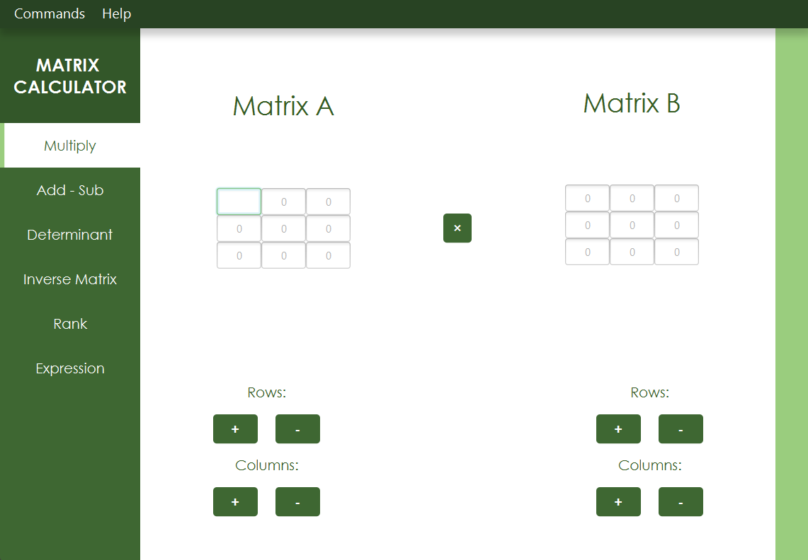
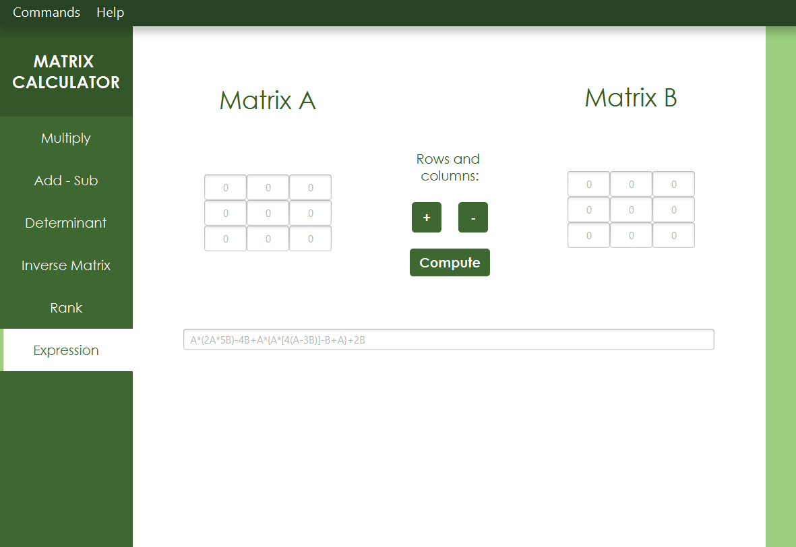
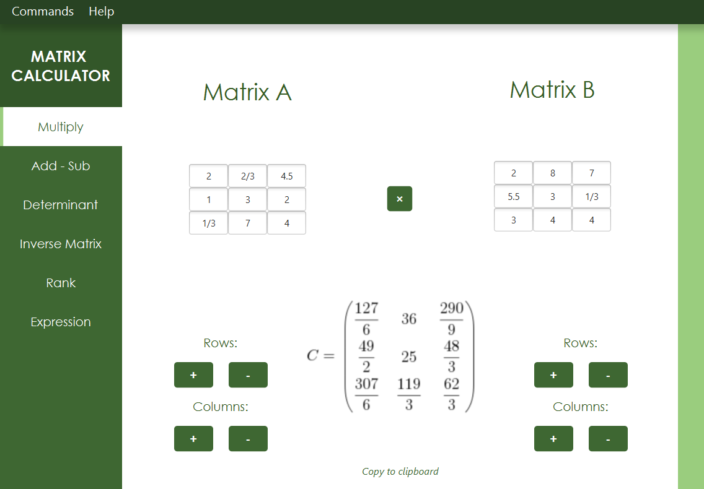
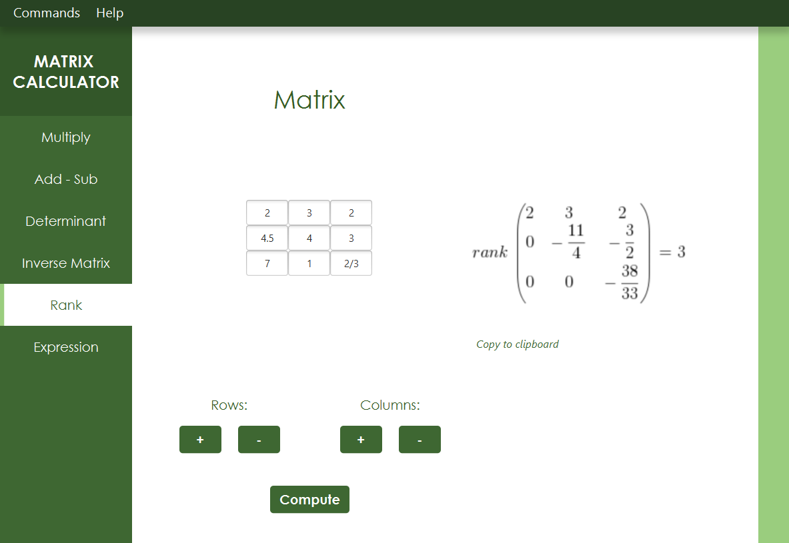

# Matrix Calculator

This is a simple JavaFX application to compute operations on matrices.

## Features

The calculator can compute:
* Multiplication between two matrices
* Addition or subtraction between two matrices
* Determinant of a matrix
* Inverse of a matrix
* Rank of a matrix
* A simple expression with two matrices

## Commands

* Insert your matrices (you can insert integers, decimal numbers or fraction, as 2/3) in the visible text fields. To add rows and columns click + or - under the matrix you want to be bigger or smaller. 
* If you add columns to matrix A or row to matrix B for the matrix product, a row/column to the other matrix will be added automatically to preserve the validity of the multiplication.
* To work better with bigger matrices, resize the window to leave more space to the matrices.
* If your input is absent, too big or invalid, it will be automatically replaced with a 0. 
* With big matrices, use scrollbars to view the entire result matrix. 
* If you want to compute an expression with multiplication, addition and subtraction, you can work just with *n*x*n* matrices to avoid conflicts. 
* Resizing the window to a smaller one, you could lose some columns or rows so that the matrices will fit in the window.

## Notes

This is an application built in 2020 as an occasion to learn this framework, the design is basic and there are some bugs. Results are rendered in LaTeX only for aesthetic purposes. 